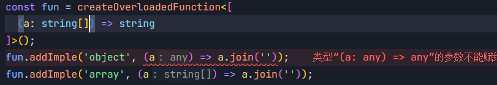
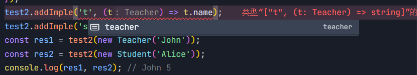
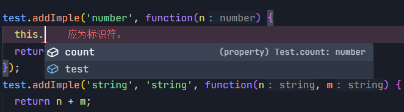

# overload-func

## 介绍

overload-func 是一个**极少量运行时代码**的函数重载库，提供一种简单优雅的方式来实现函数重载。

<font size="6">优雅永不过时！！！</font>

## 安装

```
npm install overload-func
```

## 使用

1. 定义重载

调用 `createOverloadedFunction` 方法，需要一个类型参数，传入一个数组，每一项都是一个函数类型。

```typescript
import { createOverloadedFunction } from 'overload-func';

const func = createOverloadedFunction<[
  (a: string) => string,
  (a: number, b: number) => boolean
]>();
```

2. 添加实现

调用 `addImple` 方法，最后一个参数为函数实现，之前的各个参数都是字符串，对应不同的参数类型。

```typescript
func.addImple('string', (a) => {
  return a;
});
func.addImple('number', 'number', (a, b) => {
  return a > b;
});
```

TS 会根据传入的参数类型，自动推导匹配对应的函数类型。


如果匹配不到相应的函数类型，或者定义的实现函数参数或返回值类型不匹配，TS 就会报错，拥有完善的类型检查和提示。


> 小技巧：调用 `addImple` 方法时，先写好最后一个函数参数占位，再写前面的参数类型，就可以随时获得代码补全提示，


更多内置类型详见 [*内置类型*](#内置类型)

3. 调用

和 TS 原生的函数重载一样，调用时只需要传入正确的参数类型即可。

```typescript
const r1 = func('hello'); // string
const r2 = func(1, 2); // boolean
```

会自动匹配到对应的函数实现，并返回结果，并且 TS 也会提示出正确的返回类型。

## 使用细节

### 内置类型

内置的类型支持：（字符串 -- 对应类型）

- string -- `string`
- number -- `number`
- boolean -- `boolean`
- null -- `null`
- undefined -- `undefined`
- symbol -- `symbol`
- bigint -- `bigint`
- function -- `Function`
- array -- `any[]`
- date -- `Date`
- map -- `Map`
- set -- `Set`
- weakmap -- `WeakMap`
- weakset -- `WeakSet`
- regexp -- `RegExp`
- promise -- `Promise`
- error -- `Error`
- object -- `object`

目前支持这些类型，包含所有基本类型，以及一些常用的内置类型。能够满足大部分的场景。

需要注意的是，`object` 类型不能和其他内置类型匹配，例如 `any[]`、`Map` 等，这些类型本该满足 `extends object` 的条件，但是为了更好的作区分，内部判断时**不为 `object` 类型的其他内置类型，是不会被认为匹配 `object` 类型的**。例如这样：

```typescript
const fun = createOverloadedFunction<[
  (a: string[]) => string
]>();
fun.addImple('object', (a) => a.join('')); // error
fun.addImple('array', (a) => a.join(''));
```



你不能拿 `object` 参数去匹配 `string[]`，虽然这在 TS 中看起来是正常的，但在这里你需要用 `array` 来匹配数组类型。

源码中使用了一个 `LooseEqual` 类型工具来匹配函数参数类型

```typescript
export type LooseEqual<X, Y> = Equal<Y, object> extends true
  ? X extends BaseType
    ? false
    : X extends Y
    	? true
    	: false
  : X extends Y ? true : false;
```

其中 `BaseType` 为`object` 以外的其他**内置类型**。`object` 类型会单独处理，不会和其他内置类型匹配。

### 可选参数

目前**不支持**在函数签名中使用**可选参数**。

例如：`(a: number, b?: string) => boolean`，如果使用这样的可选参数，使用中是可能会出错的。因为类似于 `func(1)` 这样的调用，没法正确匹配到函数实现。暂时还没有想到好的解决方案。

我们可以通过下面的方式处理需要可选参数的场景。

```typescript
const fn = createOverloadedFunction<[
  (a: number) => boolean,
  (a: number, b: string) => boolean,
]>();
```

不过话说回来，可选参数的场景，在函数实现中就存在判断参数类型的逻辑。这好像和我们使用这个库编写重载代码的初衷相悖吧😂。当然大家有什么好的想法，欢迎交流指教。

### 结构化类型

TS 是结构化类型系统，所以我们在推导类型、定义使用重载、处理使用中遇到的问题时，一定要从**结构化类型**的角度出发来考虑问题。

看下面的例子（使用了后面会介绍到的 [*拓展类型*](#拓展类型)）

```typescript
class Person {
  constructor(public name: string, public age: number) {}
}
const extendType = createExtendType({
  person: Person,
});
const fn = createOverloadedFunction<[
  (a: { name: string, age: number }) => number,
  (a: Person) => boolean
], typeof extendType>({
  extendType: extendType
});
fn.addImple('object', (a) => a.age);
fn.addImple('person', (a) => a.age > 18); // error
```

在上面的例子中，两个实现匹配到的都是第一个函数签名（运行起来虽然会得到想要的结果，但是 TS 会报错）。因为 TS 是结构化类型，`Person` 类型和 `{ name: string, age: number }` 是兼容的。

如果确实需要上面的功能，就需要两个对象拥有明确区别的属性。我们可以为 `Person` 添加一个 `gender` 属性，为 `{ name: string, age: number }` 添加一个 `id` 属性。这样一来，就能正确匹配到各自的函数签名。

## 高阶指引

`createOverloadedFunction` 方法支持一些配置选项，可以更灵活地定制函数重载。

### 为一个重载添加多个实现

**默认情况下，一个重载只允许添加一个实现**。如果需要允许多个实现，可以设置 `allowMultiple` 配置选项，设置为 `true` 时，可以为一个重载添加多个实现。

```typescript
const func = createOverloadedFunction<[
  (a: string) => string,
  (a: number, b: number) => boolean
]>({ allowMultiple: true });

func.addImple('string', (a) => {
  console.log('first implementation');
  return a;
});
func.addImple('string', (a) => {
  console.log('second implementation');
  return a.toUpperCase();
});

const r1 = func('hello'); // HELLO
```

此时，调用函数并传入一个 `string` 类型参数，会**依次调用两个实现函数**。但是要注意，**返回值为最后一个实现函数的返回值**。


### 拓展类型

`extendType` 参数允许扩展类型支持，可以为 `addImple` 方法拓展可选类型参数。

通过创建类来定义类型，传入对象，键名将作为 `addImple` 方法的可选类型参数，类作为键值。这里希望推荐 `createExtendType` 方法创建拓展类型（可以得到更好的类型检查）。

1. 函数的返回值传入 `extendType` 参数
2. 函数返回值的函数

```typescript
class Teacher {
  salary: number;
  constructor(public name: string) {}
}
class Student {
  score: number;
  constructor(public name: string) {}
}
const extendType2 = createExtendType({
  teacher: Teacher,
  student: Student,
});
const test2 = createOverloadedFunction<[
  (t: Teacher) => string,
  (s: Student) => number,
], typeof extendType2>({
  extendType: extendType2,
});
test2.addImple('teacher', (t) => t.name);
test2.addImple('student', (s) => s.name.length);
const res1 = test2(new Teacher('John'));
const res2 = test2(new Student('Alice'));
console.log(res1, res2); // John 5
```

正如之前 [*结构化类型*](#结构化类型) 中提到的问题，TS 是结构化类型系统。所以上面的例子中，为了区分 `Teacher` 和 `Student`，它们必须拥有能够区分彼此的不同属性。

当通过 `extendType` 拓展类型时，`addImple` 方法的可选类型参数就会增加 `teacher` 和 `student`，同时也会有相应的代码提示。



### 在类中使用

要在类中使用函数，重要的一点就是正确处理 `this` 的指向，并且在 TS 类型中正确推导它。如果你 TS 写的还不错，那这和上面例子的使用并没有大的区别。

```typescript
const test = createOverloadedFunction<[
	(this: Test, n: number) => boolean,
	(this: Test, n: string, s: string) => string,
]>();

test.addImple('number', function(n) {
	return n > this.count;
});
test.addImple('string', 'string', function(n, m) {
	return n + m;
});
class Test {
  count = 10
  test = test
}
const t = new Test();

console.log(t.test(8));
console.log(t.test('pknk', 'lll'));
```

1. 在定义函数签名时，需要使用 `this` 类型来指定 `this` 的指向。
2. 在添加实现函数时，不能使用箭头函数，而是使用普通函数。这是 JS 基础知识，这里就不做赘述。

这样就可以实现重载的同时，拥有正确的 `this` 类型推导。


