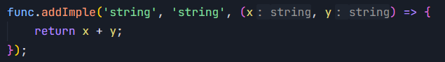

# overload-func

## 介绍

overload-func 是一款轻量级的函数重载库，提供一种简单优雅的方式来实现函数重载。

<font size="6">优雅永不过时！！！</font>

## 安装

```
npm install overload-func
```

## 使用

1. 定义重载

调用 `createOverloadedFunction` 方法，需要一个类型参数，传入一个数组，每一项都是一个函数类型。

```typescript
import { createOverloadedFunction } from 'overload-func';

const func = createOverloadedFunction<[
  (a: string) => string,
  (a: number, b: number) => boolean
]>();
```

2. 添加实现

调用 `addImple` 方法，最后一个参数为函数实现，之前的各个参数都是字符串，对应不同的参数类型。

```typescript
func.addImple('string', (a) => {
  return a;
});
func.addImple('number', 'number', (a, b) => {
  return a > b;
});
```

TS 会根据传入的参数类型，自动推导匹配对应的函数类型。



如果匹配不到相应的函数类型，或者定义的实现函数参数或返回值类型不匹配，TS 就会报错，拥有完善的类型检查和提示。


> 小技巧：调用 `addImple` 方法时，先写好最后一个函数参数占位，再写前面的参数类型，就可以随时获得代码补全提示，


更多内置类型详见 [*内置类型*](#内置类型)

3. 调用

和 TS 原生的函数重载一样，调用时只需要传入正确的参数类型即可。

```typescript
const r1 = func('hello'); // string
const r2 = func(1, 2); // boolean
```

会自动匹配到对应的函数实现，并返回结果，并且 TS 也会提示出正确的返回类型。

## 使用细节

### 内置类型

内置的类型支持：（字符串 -- 对应类型）

- string -- `string`
- number -- `number`
- boolean -- `boolean`
- null -- `null`
- undefined -- `undefined`
- symbol -- `symbol`
- bigint -- `bigint`
- function -- `Function`
- array -- `any[]`
- date -- `Date`
- map -- `Map`
- set -- `Set`
- weakmap -- `WeakMap`
- weakset -- `WeakSet`
- regexp -- `RegExp`
- promise -- `Promise`
- error -- `Error`
- object -- `object`

目前支持这些类型，包含所有基本类型，以及一些常用的内置类型。能够满足大部分的场景。

相较于 array、map 这些数据类型，object 匹配优先级最低。

### 可选参数


### 结构化类型

TS 是结构化类型系统，所以我们在推导类型、定义使用重载、处理使用中遇到的问题时，一定要从**结构化类型**的角度出发来考虑问题。

看下面的例子（使用了后面会介绍到的 [*拓展类型*](#拓展类型)）

```typescript
class Person {
	constructor(public name: string, public age: number) {}
}
const extendType = createExtendType({
	person: Person,
});
const fn = createOverloadedFunction<[
	(a: { name: string, age: number }) => number,
	(a: Person) => boolean
], typeof extendType>({
	extendType: extendType
});
fn.addImple('object', (a) => a.age);
fn.addImple('person', (a) => a.age > 18);
```

## 高阶指引

`createOverloadedFunction` 方法支持一些配置选项，可以更灵活地定制函数重载。

### 为一个重载添加多个实现

默认情况下，一个重载只允许添加一个实现。如果需要允许多个实现，可以设置 `allowMultiple` 配置选项，设置为 `true` 时，可以为一个重载添加多个实现。

```typescript
const func = createOverloadedFunction<[
  (a: string) => string,
  (a: number, b: number) => boolean
]>({ allowMultiple: true });

func.addImple('string', (a) => {
  console.log('first implementation');
  return a;
});
func.addImple('string', (a) => {
  console.log('second implementation');
  return a.toUpperCase();
});

const r1 = func('hello'); // HELLO
```

此时，调用函数并传入一个 `string` 类型参数，会依次调用两个实现函数。但是要注意，**返回值为最后一个实现函数的返回值**。

### 拓展类型

`extendType` 参数允许扩展类型支持，可以为 `addImple` 方法拓展可选类型参数。

```typescript
class Teacher {
  salary: number;
  constructor(public name: string) {}
}
class Student {
  score: number;
  constructor(public name: string) {}
}
const extendType2 = createExtendType({
  teacher: Teacher,
  student: Student,
});
const test2 = createOverloadedFunction<[
  (t: Teacher) => string,
  (s: Student) => number,
], typeof extendType2>({
  extendType: extendType2,
});
test2.addImple('teacher', (t) => t.name);
test2.addImple('student', (s) => s.name.length);
const res1 = test2(new Teacher('John'));
const res2 = test2(new Student('Alice'));
console.log(res1, res2); // John 5
```
